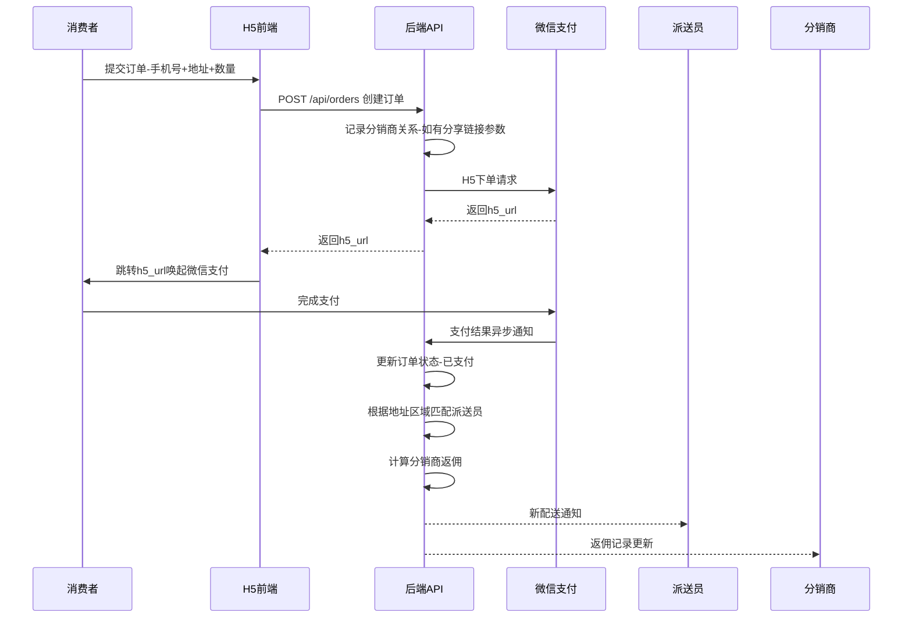

## 产品概述

一个卖水管理系统（H5网页应用），包含三个用户角色：消费者、分销商、派送员，以及管理员后台。消费者可通过H5页面直接购买水或通过分销商分享链接购买；分销商可充值购买水并获得推广返佣；派送员接收系统自动匹配的配送订单。

## 核心功能

- **消费者端**：H5购买页面（输入手机号、收货地址、数量），支持直接访问和通过分销商链接访问（自动绑定返佣关系）
- **分销商端**：H5充值/购买水页面，生成专属推广分享链接，查看返佣记录和佣金余额
- **派送员端**：H5接单页面，按负责区域/片区自动匹配订单，查看配送任务列表和状态
- **管理员后台**：手动录入/管理分销商信息、派送员信息及负责区域；配置水产品价格、返佣规则（百分比/固定金额可配置）；管理所有订单；微信支付对接
- **支付集成**：微信H5支付（后端下单返回h5_url，前端跳转调起支付）
- **订单流程**：下单 -> 微信支付 -> 支付回调确认 -> 自动匹配派送员(按区域) -> 派送员接单/完成配送

## 技术栈

- **前端**: React 18 + TypeScript + Vite + Tailwind CSS（H5移动端适配）
- **后端**: Node.js + Express + TypeScript
- **数据库**: SQLite (better-sqlite3) / 生产环境可切换 PostgreSQL
- **支付**: 微信支付 H5支付 (API v3)
- **认证**: JWT Token

## 架构设计

采用前后端分离架构：

- **前端**：React SPA，根据URL参数区分角色入口（消费者/分销商/派送员），移动端H5响应式布局
- **后端**：Express RESTful API，模块化路由结构（消费者API、分销商API、派送员API、管理员API、支付回调API）
- **数据层**：SQLite 轻量级数据库，包含：users(用户)、distributors(分销商)、deliverymen(派送员)、orders(订单)、products(产品)、commissions(佣金)、areas(区域)、system_config(系统配置)

### 系统架构图

```mermaid
graph TB
    subgraph 前端[H5前端 - React]
        C[消费者页面]
        D[分销商页面]
        DL[派送员页面]
    end
    subgraph 后端[Node.js Express API]
        API_USER[用户/订单API]
        API_DIST[分销商API]
        API_DELV[派送员API]
        API_ADMIN[管理员API]
        API_PAY[支付回调API]
    end
    subgraph 数据层[(SQLite DB)]
        TBL_U[users]
        TBL_D[distributors]
        TBL_DL[deliverymen]
        TBL_O[orders]
        TBL_C[commissions]
        TBL_A[areas]
        TBL_CFG[config]
    end
    subgraph 外部服务
        WXPAY[微信支付]
    end
    C --> API_USER
    D --> API_DIST
    DL --> API_DELV
    API_ADMIN --> TBL_U & TBL_D & TBL_DL & TBL_A & TBL_CFG
    API_PAY --> WXPAY
    API_PAY --> TBL_O & TBL_C
```

### 订单与返佣流程



## 关键实现细节

- **区域匹配逻辑**：订单地址解析 -> 匹配areas表中的区域规则 -> 关联该区域的派送员 -> 自动分配订单
- **分销链接机制**：分销商专属链接携带 distributor_id 参数，消费者通过此链接下单时自动记录推荐关系
- **返佣计算**：从 system_config 读取返佣规则（类型: percentage/fixed, 值: 数字），支付成功后异步计算并记录
- **微信H5支付流程**：前端提交订单 -> 后端调用统一下单接口 -> 返回h5_url -> 前端跳转 -> 用户支付 -> 微信回调通知后端 -> 后端更新订单状态

## 目录结构

```
water/
├── server/                          # [NEW] 后端服务
│   ├── src/
│   │   ├── index.ts                 # [NEW] Express应用入口
│   │   ├── config.ts                # [NEW] 配置管理-数据库/微信支付/JWT密钥
│   │   ├── app.ts                   # [NEW] Express实例-中间件注册
│   │   ├── routes/
│   │   │   ├── index.ts             # [NEW] 路由汇总
│   │   │   ├── customer.routes.ts   # [NEW] 消费者相关API-创建订单/查询订单
│   │   │   ├── distributor.routes.ts # [NEW] 分销商相关API-分享链接/佣金查询
│   │   │   ├── deliveryman.routes.ts # [NEW] 派送员相关API-接单/更新配送状态
│   │   │   ├── admin.routes.ts      # [NEW] 管理员API-CRUD分销商/派送员/区域/配置
│   │   │   └── payment.routes.ts    # [NEW] 支付相关API-创建支付/回调通知/查单
│   │   ├── controllers/
│   │   │   ├── customer.controller.ts    # [NEW] 消费者业务逻辑
│   │   │   ├── distributor.controller.ts # [NEW] 分销商业务逻辑
│   │   │   ├── deliveryman.controller.ts # [NEW] 派送员业务逻辑
│   │   │   ├── admin.controller.ts       # [NEW] 管理员业务逻辑
│   │   │   └── payment.controller.ts     # [NEW] 微信支付逻辑-H5下单/签名/回调处理
│   │   ├── services/
│   │   │   ├── order.service.ts          # [NEW] 订单核心服务-创建/匹配派送员/状态流转
│   │   │   ├── commission.service.ts     # [NEW] 返佣计算服务-读取配置/计算/记录
│   │   │   ├── matching.service.ts       # [NEW] 区域匹配服务-地址到派送员的映射
│   │   │   └── wechatPay.service.ts      # [NEW] 微信支付服务-V3签名/H5下单/验证回调
│   │   ├── models/
│   │   │   ├── user.model.ts             # [NEW] 用户数据模型
│   │   │   ├── order.model.ts            # [NEW] 订单数据模型
│   │   │   ├── distributor.model.ts      # [NEW] 分销商数据模型
│   │   │   ├── deliveryman.model.ts      # [NEW] 派送员数据模型-含关联区域
│   │   │   ├── commission.model.ts       # [NEW] 佣金记录模型
│   │   │   ├── area.model.ts             # [NEW] 区域/片区模型
│   │   │   └── product.model.ts          # [NEW] 产品/水型号模型
│   │   ├── middleware/
│   │   │   ├── auth.middleware.ts        # [NEW] JWT认证中间件
│   │   │   ├── errorHandler.ts           # [NEW] 全局错误处理
│   │   │   └── roleCheck.ts              # [NEW] 角色权限校验
│   │   ├── utils/
│   │   │   ├── db.ts                     # [NEW] 数据库连接与初始化-建表
│   │   │   ├── jwt.ts                    # [NEW] JWT工具函数
│   │   │   └── response.ts               # [NEW] 统一响应格式封装
│   │   └── types/
│   │       └── index.ts                  # [NEW] 全局TypeScript类型定义
│   ├── package.json
│   └── tsconfig.json
├── client/                          # [NEW] 前端H5应用
│   ├── public/
│   │   └── index.html
│   ├── src/
│   │   ├── main.tsx                  # [NEW] React入口
│   │   ├── App.tsx                   # [NEW] 根组件-路由配置
│   │   ├── api/
│   │   │   ├── client.ts             # [NEW] Axios实例配置
│   │   │   ├── customer.api.ts       # [NEW] 消费者API调用
│   │   │   ├── distributor.api.ts    # [NEW] 分销商API调用
│   │   │   ├── deliveryman.api.ts    # [NEW] 派送员API调用
│   │   │   └── admin.api.ts          # [NEW] 管理员API调用
│   │   ├── pages/
│   │   │   ├── customer/
│   │   │   │   ├── OrderPage.tsx     # [NEW] 消费者下单页-手机号/地址/数量输入
│   │   │   │   ├── OrderResult.tsx   # [NEW] 下单结果页-支付跳转/成功失败展示
│   │   │   │   └── OrderList.tsx     # [NEW] 我的订单列表
│   │   │   ├── distributor/
│   │   │   │   ├── Dashboard.tsx     # [NEW] 分销商仪表盘-概览数据
│   │   │   │   ├── RechargePage.tsx  # [NEW] 充值/购买水页面
│   │   │   │   ├── SharePage.tsx     # [NEW] 推广分享页-二维码/链接
│   │   │   │   └── CommissionPage.tsx # [NEW] 佣金明细页
│   │   │   ├── deliveryman/
│   │   │   │   ├── TaskList.tsx      # [NEW] 配送任务列表
│   │   │   │   └── TaskDetail.tsx    # [NEW] 任务详情-接单/导航/完成
│   │   │   └── admin/
│   │   │       ├── Login.tsx         # [NEW] 管理员登录
│   │   │       ├── Dashboard.tsx     # [NEW] 管理仪表盘
│   │   │       ├── DistributorManage.tsx  # [NEW] 分销商管理-增删改查
│   │   │       ├── DeliverymanManage.tsx  # [NEW] 派送员管理-含区域设置
│   │   │       ├── AreaManage.tsx    # [NEW] 区域/片区管理
│   │   │       ├── OrderManage.tsx   # [NEW] 订单管理列表
│   │   │       ├── ProductManage.tsx # [NEW] 产品/水型号管理-定价
│   │   │       └── ConfigPage.tsx    # [NEW] 系统配置-返佣规则等
│   │   ├── components/
│   │   │   ├── layout/
│   │   │   │   ├── MobileLayout.tsx # [NEW] H5移动端通用布局
│   │   │   │   └── AdminLayout.tsx  # [NEW] 管理后台PC布局
│   │   │   ├── common/
│   │   │   │   ├── OrderForm.tsx    # [NEW] 订单表单组件-复用于消费者和分销商
│   │   │   │   ├── PaymentButton.tsx # [NEW] 微信支付按钮-拉起H5支付
│   │   │   │   └── StatusBadge.tsx  # [NEW] 状态标签组件
│   │   │   └── admin/
│   │   │       ├── DataTable.tsx    # [NEW] 通用表格组件
│   │   │       ├── ModalForm.tsx     # [NEW] 弹窗表单组件
│   │   │       └── Sidebar.tsx      # [NEW] 管理后台侧边栏
│   │   ├── hooks/
│   │   │   ├── useOrder.ts          # [NEW] 订单相关Hook
│   │   │   └── useAuth.ts           # [NEW] 认证Hook
│   │   ├── stores/
│   │   │   └── store.ts             # [NEW] 全局状态-Zustand
│   │   ├── utils/
│   │   │   └── shareLink.ts         # [NEW] 分销链接生成工具
│   │   └── styles/
│   │       └── globals.css          # [NEW] 全局样式-Tailwind
│   ├── package.json
│   ├── vite.config.ts
│   ├── tsconfig.json
│   └── tailwind.config.js
├── package.json                     # [NEW] 根package.json-workspaces
└── README.md                        # [NEW] 项目说明文档
```

## 设计概述

本系统分为两个视觉层面：

1. **H5移动端页面**（面向消费者/分销商/派送员）：清新、简洁的移动端体验，以蓝色为主色调体现水的纯净感
2. **管理后台**（面向管理员）：专业的桌面端管理系统，高效的数据操作界面

## 设计风格

采用**清新流体风格(Fluid Fresh)** - 以水的流动感为核心设计语言。主色调使用渐变蓝绿色系，象征水的纯净与活力。配合圆角卡片、微动效和玻璃拟态效果，营造现代清爽的视觉体验。

## 页面规划（6个核心页面）

### 1. 消费者下单页（H5移动端）

- **顶部品牌区**：Logo + "武夷屿都山水"标语，使用波浪形底部边框
- **订单表单区**：大尺寸输入框组（手机号、收货地址选择器、购买数量步进器），卡片式容器带轻微阴影
- **商品展示区**：水产品图片/图标 + 单价 + 数量小计实时计算
- **分销标识区**：如果通过分销商链接进入，显示"来自XXX的推荐"
- **底部操作栏**：固定底部的价格汇总 + "立即购买"渐变色按钮，点击后调起微信支付

### 2. 分销商中心页（H5移动端）

- **顶部信息卡**：头像/姓名/等级 + 累计佣金 + 今日收益，使用渐变背景
- **功能入口网格**：2x2图标入口（充值买水 / 我的推广 / 佣金明细 / 订单记录）
- **推广分享区**：专属推广链接 + 二维码 + 一键复制/分享按钮
- **最近佣金流水**：最近5条佣金记录列表

### 3. 派送员接单页（H5移动端）

- **顶部状态栏**：今日待配送数 + 已完成数
- **订单卡片列表**：每个订单显示收货地址、距离、数量、预计送达时间，新订单高亮+震动动画
- **订单详情弹窗**：完整地址 + 联系电话 + 导航按钮 + 接单/完成按钮
- **历史记录Tab**：可切换查看待配送/配送中/已完成

### 4. 管理后台首页/仪表盘（桌面端）

- **左侧导航栏**：深色侧边栏，包含所有管理模块入口
- **顶部统计卡片**：4个KPI卡片（今日订单额 / 总用户数 / 活跃分销商 / 待配送订单）
- **图表区域**：近7日销售趋势折线图 + 分销商佣金排名柱状图
- **近期订单表格**：最新10条订单简表，支持快速操作

### 5. 分销商/派送员管理页（桌面端）

- **筛选工具栏**：搜索框 + 状态筛选 + 区域筛选
- **数据表格**：分页表格展示分销商/派送员列表，含操作列
- **新建/编辑抽屉**：右侧滑出表单，分销商含基本信息，派送员含区域多选
- **批量操作**：支持批量启用/禁用

### 6. 系统配置页（桌面端）

- **返佣规则配置**：选择模式（百分比/固定金额）+ 输入数值 + 预览示例
- **产品价格管理**：水产品列表，编辑各规格单价
- **区域管理**：区域名称 + 边界描述 + 绑定派送员
- **支付配置**：微信支付相关参数配置（脱敏显示）

## Agent Extensions

### Skill

- **brainstorming**
- Purpose: 在开始编码前进行需求和设计探索，确保方案完整性和合理性
- Expected outcome: 产出清晰的功能需求清单和技术设计方案
- **writing-plans**
- Purpose: 制定详细的分步骤实施计划，确保开发有序进行
- Expected outcome: 结构化的开发任务清单，包含依赖关系